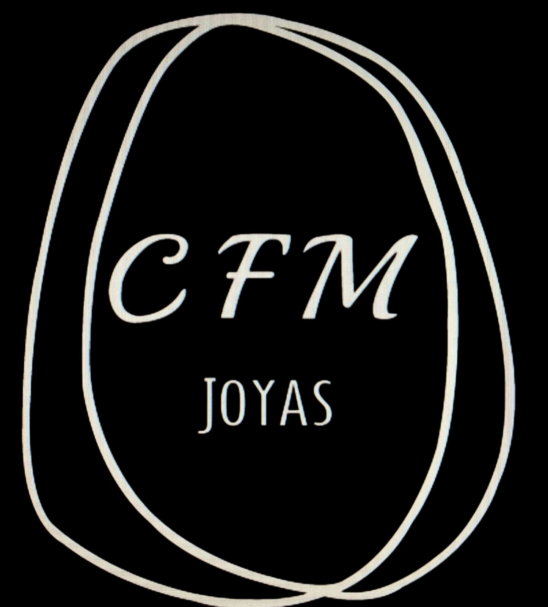

# 💎 CFM Joyas - Sistema Web de Joyería

**Sistema web completo para la gestión y venta de joyas, cerámicas y accesorios artesanales.**



## 🌟 Características Principales

- ✨ **Diseño responsive** y moderno con Bootstrap 5
- 🔐 **Panel de administración seguro** con doble autenticación
- 💰 **Sistema de precios** en pesos chilenos (CLP)
- 🏷️ **Categorización de productos** (Joyas, Cerámicas, Otros)
- 📸 **Carrusel de imágenes** con fotos reales de productos
- 📱 **Totalmente responsive** (móvil, tablet, escritorio)
- 🎨 **Tipografía elegante** con Google Fonts
- 📧 **Formulario de contacto** con PHPMailer
- 🔗 **Integración con redes sociales** (Instagram, Facebook, WhatsApp)
- 🛡️ **Seguridad avanzada** con protección contra ataques

## 🚀 Tecnologías Utilizadas

### Frontend
- **HTML5** - Estructura semántica
- **CSS3** - Estilos personalizados y animaciones
- **Bootstrap 5** - Framework CSS responsive
- **JavaScript** - Interactividad y efectos
- **Font Awesome** - Iconografía
- **Google Fonts** - Tipografía (Playfair Display + Inter)

### Backend
- **PHP 7.4+** - Lógica del servidor
- **MySQL** - Base de datos
- **PHPMailer** - Envío de correos
- **PHP DotEnv** - Gestión de variables de entorno

### Seguridad
- **Password Hashing** (bcrypt)
- **Prepared Statements** (SQL injection protection)
- **CSRF Protection**
- **Input Sanitization**
- **Session Management**
- **Rate Limiting** (intentos de login)

## 📋 Requisitos del Sistema

- **PHP** 7.4 o superior
- **MySQL** 5.7 o superior
- **Apache** con mod_rewrite
- **Composer** (para dependencias)
- **Extensiones PHP**: mysqli, mbstring, openssl

## ⚡ Instalación Rápida

### 1. Clonar el Repositorio
```bash
git clone https://github.com/sergi199904/CFM-Joyas.git
cd CFM-Joyas
```

### 2. Configurar Servidor Web
```bash
# Copiar a htdocs (XAMPP/WAMP)
cp -r CFM-Joyas/ /xampp/htdocs/cfmjoyas/

# O configurar virtual host
```

### 3. Instalar Dependencias
```bash
composer install
```

### 4. Configurar Base de Datos
```bash
# Iniciar Apache y MySQL en puerto 3307
# Importar base de datos
mysql -u root -p < sql/cfmjoyas_completo.sql
```

### 5. Configurar Variables de Entorno
```bash
# Copiar archivo de ejemplo
cp .env.example .env

# Editar .env con tus credenciales
nano .env
```

### 6. Configurar Directorio de Imágenes
```bash
mkdir -p img/productos img/carrusel
chmod 755 img/productos img/carrusel
```

## 🗄️ Estructura de la Base de Datos

### Tabla `usuarios`
- Gestión de administradores
- Autenticación segura con doble factor
- Control de intentos fallidos y bloqueos

### Tabla `productos`
- Información completa de productos
- Precios en CLP
- Categorización automática
- Enlaces a Instagram

### Tabla `categorias`
- Sistema de categorías dinámico
- Filtrado automático en frontend

## 🔑 Credenciales de Acceso

### Usuario Administrador
- **Email**: `admin@cfmjoyas.com`
- **Contraseña**: `admin123`
- **Código de Acceso**: `CFM2025` (o `JOYAS2025`, `ADMIN2025`)

### Panel de Administración
Accede en: `/admin/login.php`

## 📁 Estructura del Proyecto

```
CFM-Joyas/
├── admin/                  # Panel de administración
│   ├── dashboard.php       # Dashboard principal
│   ├── login.php          # Login seguro
│   ├── register.php       # Registro de usuarios
│   ├── edit_producto.php  # Edición de productos
│   └── subir_producto.php # Subida de productos
├── css/
│   └── style.css          # Estilos personalizados
├── img/
│   ├── productos/         # Imágenes de productos
│   └── carrusel/          # Imágenes del carrusel
├── includes/
│   └── db.php            # Conexión a base de datos
├── sql/
│   └── cfmjoyas_completo.sql # Base de datos completa
├── index.php             # Página principal
├── send_email.php        # Procesamiento de contacto
├── composer.json         # Dependencias PHP
├── .env.example         # Variables de entorno
└── README.md           # Este archivo
```

## 🎨 Características de Diseño

### Tipografía
- **Títulos**: Playfair Display (serif elegante)
- **Texto**: Inter (sans-serif moderna)
- **Jerarquía visual** consistente

### Colores
- **Primario**: Negro (#000) con degradados
- **Acentos**: Dorado (#ffd700)
- **Éxito**: Verde (#28a745)
- **Fondo**: Gris claro (#f8f9fa)

### Componentes
- **Navbar sticky** con animaciones
- **Carrusel responsive** con proporción automática
- **Cards de productos** con hover effects
- **Filtros por categoría** con badges
- **Formularios** con validación visual

## 🛡️ Características de Seguridad

### Autenticación
- **Doble factor**: Email + Contraseña + Código de acceso
- **Hashing seguro** con bcrypt
- **Protección contra fuerza bruta**: Bloqueo tras 3 intentos
- **Gestión de sesiones** segura

### Validación de Datos
- **Sanitización** de inputs
- **Validación** de tipos de archivo
- **Límites de tamaño** para uploads
- **Prepared statements** para SQL

### Protección de Archivos
- **Validación de formatos** de imagen
- **Nombres únicos** para archivos subidos
- **Directorio protegido** para uploads

## 📧 Configuración de Email

### PHPMailer Setup
```env
SMTP_HOST=smtp.gmail.com
SMTP_USERNAME=tu_correo@gmail.com
SMTP_PASSWORD=tu_contraseña_de_aplicacion
SMTP_PORT=587
```

### Gmail App Password
1. Habilitar verificación en 2 pasos
2. Generar contraseña de aplicación
3. Usar esa contraseña en `.env`

## 🌐 Despliegue en Producción

### Hosting Compartido
1. Subir archivos vía FTP/cPanel
2. Crear base de datos en panel de hosting
3. Importar SQL via phpMyAdmin
4. Configurar variables de entorno
5. Ajustar permisos de directorios

### VPS/Dedicado
```bash
# Clonar repositorio
git clone https://github.com/sergi199904/CFM-Joyas.git

# Configurar Apache/Nginx
# Instalar dependencias
# Configurar SSL (Certbot)
# Configurar firewall
```

## 🔧 Personalización

### Agregar Nueva Categoría
1. Insertar en tabla `categorias`
2. Los filtros se actualizan automáticamente

### Cambiar Colores
Editar variables CSS en `style.css`:
```css
:root {
  --color-primary: #000;
  --color-accent: #ffd700;
  --color-success: #28a745;
}
```

### Agregar Redes Sociales
Editar sección de redes en `index.php`

## 📱 Responsive Design

### Breakpoints
- **Mobile**: < 768px
- **Tablet**: 768px - 992px  
- **Desktop**: > 992px

### Características Mobile
- **Navbar colapsible**
- **Carrusel adaptativo**
- **Touch-friendly** buttons
- **Optimización** de imágenes

## 🚀 Optimizaciones

### Performance
- **Imágenes optimizadas** (WebP support)
- **CSS minificado** en producción
- **Lazy loading** para carrusel
- **Caching** de assets

### SEO
- **Meta tags** optimizados
- **Estructura semántica** HTML5
- **Alt text** en imágenes
- **URLs amigables**

## 🐛 Troubleshooting

### Problemas Comunes

#### "No se cargan los estilos"
```bash
# Verificar ruta del CSS
# Limpiar cache del navegador
Ctrl + Shift + R
```

#### "Error de conexión a BD"
```bash
# Verificar credenciales en includes/db.php
# Verificar que MySQL esté corriendo en puerto 3307
```

#### "No se suben imágenes"
```bash
# Verificar permisos de directorio
chmod 755 img/productos
```

#### "No funciona el envío de emails"
```bash
# Verificar configuración SMTP en .env
# Verificar contraseña de aplicación Gmail
```

## 📞 Soporte y Contacto

### Información del Negocio
- **Teléfono**: +56 9 9843 5160
- **Email**: cfmjoyas@gmail.com
- **Instagram**: [@cfmjoyas](https://www.instagram.com/cfmjoyas/)
- **Facebook**: [CFM Joyas](https://www.facebook.com/profile.php?id=100075879374011)
- **Ubicación**: Zapallar, Chile

### Desarrollador
- **GitHub**: [sergi199904](https://github.com/sergi199904)
- **Proyecto**: CFM-Joyas

## 📄 Licencia

Este proyecto está bajo la **Licencia Apache 2.0**. Ver `LICENSE` para más detalles.

## 🔄 Changelog

### v1.0.0 (2025-06-23)
- ✨ Lanzamiento inicial
- 🎨 Diseño responsive completo
- 🔐 Sistema de autenticación seguro
- 💰 Gestión de precios y categorías
- 📸 Carrusel de imágenes
- 📧 Sistema de contacto

---

**¡Hecho con ❤️ para CFM Joyas!**

*Especialistas en joyas y accesorios únicos*